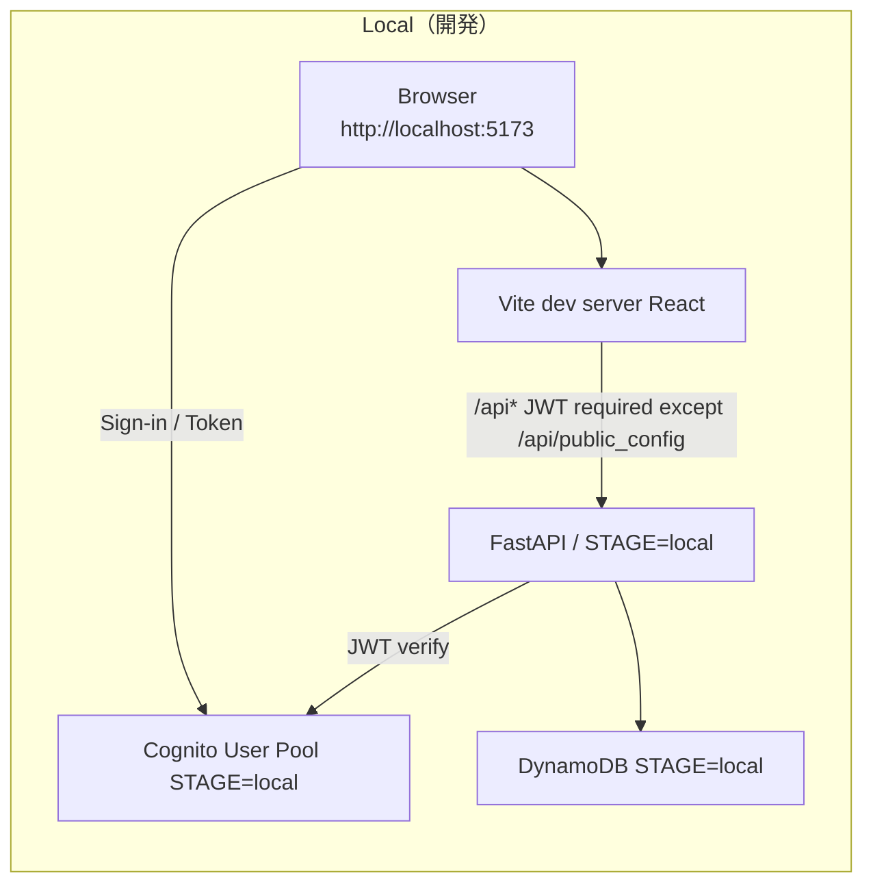
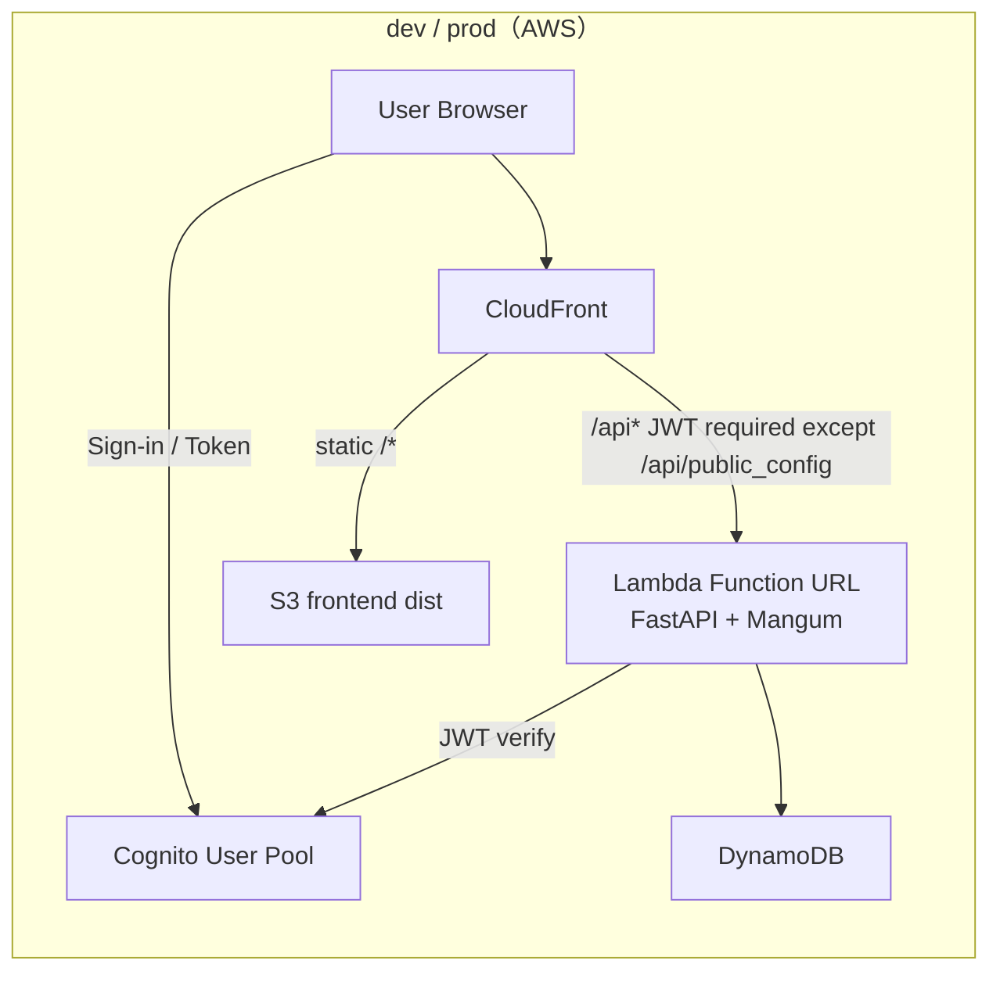

# aws-minimal-serverless-template

FastAPI + React の **最小構成サーバレステンプレ**です。
「ローカルは普段通りに開発できる」「dev/prodはCDKで一括」「環境差分と手順を最小化」を目的にしています。

## このテンプレの思想（なぜこうしているか）

* **完全 Pay per use / 構成は最小限**
  常時稼働するサーバを持たず、必要なときに使った分だけ課金される構成に寄せています。
* **local / dev / prod を体系化（同じやり方で回せる）**
  ステージごとにやることを極力変えず、CDKで再現できるテンプレを目指します。
* **local は “普通の開発” に寄せる（FastAPI + React をそのまま動かす）**
  local では FastAPI と Vite dev server を Docker Compose で起動し、開発体験を崩しません。
* **環境差分をできる限り減らす（localでもAWSリソースを使う）**
  DynamoDB / Cognito は LocalStack 等でエミュレートせず、**AWS上に local 用リソースをCDKで作って**参照します。
* **手順を少なくする（local/dev/prod を最短コマンドで）**
  読む量より “実行する量” を減らします。
* **リソース乱立を防ぐ（命名規約を固定）**
  リソース/スタックは **`${PROJECT_NAME}-${STAGE}`** で統一します。
* **できる限り docker compose にまとめる**
  CDK実行用コンテナとアプリ実行を compose で分離しつつ、作業導線を単純化します。

---

## 前提

以下が満たされている前提で手順を書きます。

* **CDK bootstrap 済み**（対象アカウント/リージョンで `cdk bootstrap` 済み）
* **必要権限を持った IAM ユーザ/ロールがある**（このREADME記載の権限）
* `~/.aws/config` / `~/.aws/credentials` に **プロファイルが設定済み**
* リポジトリ直下の `.env` に以下が設定済み

  * `PROJECT_NAME`（アカウント+リージョン内で一意）
  * `AWS_PROFILE`（`~/.aws` の profile 名）

### IAM に必要な権限

標準で使う想定のポリシー:

* `AmazonCognitoPowerUser`
* `AmazonDynamoDBFullAccess`
* `AmazonSSMReadOnlyAccess`
* `AWSCloudFormationFullAccess`

加えて、CDK が使うロールを AssumeRole するための例:

```json
{
  "Version": "2012-10-17",
  "Statement": [
    {
      "Effect": "Allow",
      "Action": "sts:AssumeRole",
      "Resource": "arn:aws:iam::<AWSアカウントID>:role/cdk-hnb659fds-*"
    }
  ]
}
```

---

## 最短手順

> **基本方針:**
>
> * local は「AWSに local 用 Cognito/DynamoDB を作る」+「FastAPI/Reactをローカルで起動」
> * dev/prod は「ビルドしてCDKで一括デプロイ」

### Local（最短）

```bash
docker-compose --profile cdk up -d
docker-compose exec cdk bash -lc "npm run deploy:local:all && npm run sync:env:local"
docker-compose --profile app:local up
```

* 起動後、http://localhost:5173 で確認

---

### dev/prod（最短）

```bash
bash build_artifacts.sh
docker-compose --profile cdk up -d
```

dev
```
docker-compose exec cdk bash -lc "npm run deploy:dev"
```

prod
```
docker-compose exec cdk bash -lc "npm run deploy:prod"
```

* デプロイ時の `StatementChange` 確認は `y` で続行
* CloudFront の URL が出たら完了
* ※ prod は削除保護あり（後述）

---

## 詳細

### 何がデプロイされるか

* **local:** DynamoDB / Cognito のみ（AWS上に “local用” を作る）
* **dev / prod:** DynamoDB / Cognito / Lambda / S3 / CloudFront を一括

### アーキテクチャ概要

**Local**

* Backend: FastAPI（コンテナで起動、`STAGE=local` 固定）
* Frontend: React + Vite dev server
* DB/Auth: DynamoDB / Cognito（AWS上の local 用リソース）



**dev / prod**

* Backend: Lambda（FastAPI を Mangum でラップしてデプロイ）
* Frontend: S3 + CloudFront
* CloudFront ルーティング:

  * `/api*` → API（Lambda 側）
  * それ以外 → S3 静的配信



### 命名規約（リソース乱立防止）

* スタック名/リソース名は **`${PROJECT_NAME}-${STAGE}`** で統一
* `STAGE` は `local / dev / prod`
* CDK エントリは `infra/bin/local.ts|dev.ts|prod.ts` で固定

### CDK コマンド設計

このリポジトリでは stage ごとに CDK のエントリを分けています（`bin/local.ts` / `bin/dev.ts` / `bin/prod.ts`）。
CDK の任意サブコマンドは `npm run cdk:{stage} -- <cdk-subcommand>` として実行できます。

```bash
npm run cdk:local -- diff
npm run cdk:dev   -- synth
```

local は DynamoDB と Cognito を用途に応じて分けてデプロイできます。

```bash
npm run deploy:local:cognito
npm run deploy:local:dynamodb
npm run deploy:local:all
```

`sync:env:local` は `cdk-outputs.json` を参照して `.env.local` を生成します（= local の Cognito を deploy 後に実行）。

```bash
npm run sync:env:local
```

### 環境変数

`.env`

* `PROJECT_NAME`: リソース名・スタック名のベース（`${PROJECT_NAME}-${STAGE}`）
* `AWS_PROFILE`: `~/.aws` の profile 名

`.env.local`（自動生成）

* local 用 Cognito 設定（User Pool ID / Client ID）
* `npm run sync:env:local` で `cdk-outputs.json` から生成

### docker-compose プロファイル

* アプリ起動（local）: `--profile app:local`
* CDK 実行用: `--profile cdk`

### ビルド（dev/prod向け）

`build_artifacts.sh` が backend/frontend をまとめてビルドします。

* backend: Lambda 互換を担保するため公式 Lambda イメージで依存を固めて `backend/dist/` に出力
* frontend: `frontend/dist/` に静的成果物を出力

実行:

```bash
bash build_artifacts.sh
```

### Cognito 設定（Pool ID / Client ID の扱い）

このテンプレでは **フロントが Cognito 設定を環境変数として持ちません**。

* backend

  * local: `.env.local` に保持
  * dev/prod: CDK が Lambda 環境変数として注入
* frontend

  * 起動時に `GET /api/public_config` から取得して `Amplify.configure()` する

### セキュリティ（このテンプレのスタンス）

このテンプレは「最小構成 / 最短導入」を優先しており、セキュリティは最低限です（商用・高リスク用途は非推奨）。

* API は基本的に Cognito の JWT 検証を前提（認証必須）
* `GET /api/public_config` はフロント初期化用のため **未認証で公開**（Pool ID / Client ID を返すだけ）
* dev/prod の API エンドポイントは CloudFront 経由で使う想定ですが、Function URL 自体は **公開設定（直叩き可能）** のままです
  * レート制限 / WAF / 署名付きオリジン（OAC + SigV4）等は入れていません

本番運用で締めたい場合は、WAF・レート制限・Function URL の IAM 化（+ CloudFront 署名）などを追加してください。

### DynamoDB テーブル定義の追加/変更

* テーブル定義: `infra/lib/dynamodb-stack.ts`
* 追加/変更時は、Lambda への権限付与（`grantReadWriteData()`）も忘れない

### 削除保護（prod）

prod（`STAGE=prod`）では誤削除対策として削除保護があります。

* Cognito（スタック/User Pool）
* DynamoDB（スタック/テーブル）
* S3 bucket

---

## License

MIT License
